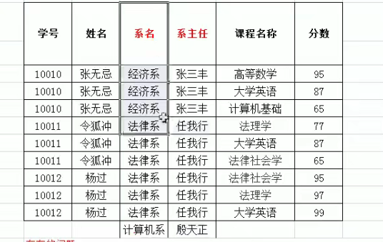

## sql

```sql
use intell_switch;

SELECT * FROM DEV_REPORT WHERE ID = '1100000000000001' and create_time BETWEEN '2024-01-04 20:00:00' AND '2024-01-06 20:59:59';


```

## 密码

```shell
http://www.xwydl.com/

https://element.eleme.cn/#/zh-CN/component/installation

https://v3.bootcss.com/

http://jdgz.xwydl.com/temper/condition/
http://jdgz.xwydl.com/intell/switch/
liub 123456
47.97.155.255 root wangyuan123dev@
liub
123.com
o534WUNDvZ7BagzffyYFQw==

Wangyuan02@05dev!
wangyuan123$
https://www.bilibili.com/video/BV1Zy4y1K7SH/?spm_id_from=333.337.search-card.all.click
https://www.taosdata.com/
```

```sql
启动服务
systemctl start taosd

创建用户
create user `用户名` pass `密码`;

修改用户密码
taos 数据库 root用户的默认密码为： taosdata，安装好taos数据库后，可以通过下语句修改密码：
alter user root pass `yourpassword`

登录数据库：
taos -uroot -p密码
如：
taos -uroot -p123456 ;

创建库（如果不存在）：
#keep 字段是指文件在表存储的时间，默认是天
create database if not exists 库名 keep n days m blocks k;
如：create database if not exists mydb keep 365 days 10 blocks 4;

使用库：
use 库名;

删除库（如果存在）：
#（如果存在）
drop database 库名;

显示所有数据库：
show databases;

修改数据库副本数：
alter database 库名 replica 数量;
如：alter database mydb replica 2;

修改数据文件保存的天数：
alter database 库名 keep 天数;
如：alter database mydb keep 35;

修改数据写入成功所需要的确认数：
alter database 库名 quorum 数目;
如：alter database mydb quorum 2;

修改每个VNODE (TSDB) 中有多少cache大小的内存块：
alter database 库名 blocks 大小;
如：alter database mydb blocks 100;

创建超级表
CREATE STABLE superTable(time TIMESTAMP, val double) TAGS (point varchar(100));
执行SQL后会创建一个叫superTable的超级表

创建子表
INSERT INTO z100 USING superTable (point) TAGS ('z100_pt') VALUES ('2023-08-17 11:07:33', 500);
执行后会新增一张z100表 并且在superTable里面新增一条子表数据。

创建STable, 与创建表的SQL语法相似，但需指定TAGS字段的名称和类型。说明：
（1) TAGS 列的数据类型不能是timestamp类型；
（2) TAGS 列名不能与其他列名相同；
 (3) TAGS 列名不能为预留关键字；
（4) TAGS 最多允许128个，可以0个，总长度不超过16k个字符
CREATE STABLE [IF NOT EXISTS] stb_name (create_definition [, create_definition] ...) TAGS (create_definition [, create_definition] ...) [table_options]如：creates stable 表名 st(time timestamp, column_name int) tags (t1 nchar(50), t2 nchar(100));

查看超级表
（1）显示当前数据库下的所有超级表信息
#查看数据库内全部 STable，及其相关信息，包括 STable 的名称、创建时间、列数量、标签（TAG）数量、通过该 STable 建表的数量。
SHOW STABLES [LIKE tb_name_wildcard];
#如：显示当前数据库下的所有超级表信息
show stables like "%super%";

（2）显示一个超级表的创建语句
#对一个已经存在的超级表，返回其创建语句；在另一个集群中执行该语句，就能得到一个结构完全相同的超级表。常用于数据库迁移。
SHOW CREATE STABLE 表名;

（3）获取超级表的结构信息
# 返回结果集的第一列为子表名，后续列为标签列。
DESCRIBE [db_name.]stb_name;
如：describe super_table ;

（4）获取超级表中所有子表的标签信息
SHOW TABLE TAGS FROM stbname;
如：SHOW TABLE TAGS FROM st;

删除超级表
#删除 STable 会自动删除通过 STable 创建的子表以及子表中的所有数据。
DROP STABLE 表名;
修改超级表
修改超级表的结构会对其下的所有子表生效。无法针对某个特定子表修改表结构。标签结构的修改需要对超级表下发，TDengine 会自动作用于此超级表的所有子表。

（1）超级表增加列
ALTER STABLE stb_name ADD COLUMN col_name column_type;
如：alter table 超级表名 add column 列名 int;

（2）超级表删除列
ALTER STABLE stb_name DROP COLUMN col_name;
如：alter table 超级表名 drop column 列名;

（3）添加标签
ALTER STABLE stb_name ADD TAG tag_name tag_type;
如：alter table 超级表名 add tag column nchar(60);

（4）删除标签
ALTER STABLE stb_name DROP TAG tag_name;
如：alter table 超级表名 drop tag 标签名;

（5）修改标签名
ALTER STABLE stb_name RENAME TAG old_tag_name new_tag_name;
如：alter table 超级表名 change tag 原标签名 新标签名;

（6）修改子表标签值(TAG)
alter table 子表名 set tag column_key = “value”;

#超级表super_table,子表sub_table,标签Tag之间的关系:
在物联网中，假设我们现在有一个小区的电表设备需要联网。那么电表就会存在张三家的电表，李四家的电表，张三家电表的电流和电压，李四家的电流和电压，以及王五等等家的设备信息。
那么，作为电表这个物联设备，就可以设计成超级表super_table,这样电表就有了张三的电表sub_table1,李四家的电表sub_table2,等等，电流和电压就是超级表中定义表字段属性，而电表所属的业主名称，小区地址可以存放在TAG。
这个场景中，我们就可以下如下创建语句:
(1)创建电表超级表：super_table
create database mydb；
use mydb；
create table super_dianbiao（ts timestamp,dianya float,dianliu float） tags (yezhu_name nchar(15),xiaoqu_location nchar(50),menpai_num nchar(10));
(2)创建子表dianbiao……
create table dianbiao1001 using super_dianbiao tags(‘张三’,‘东城小区’,‘1-1101’);
create table dianbiao1002 using super_dianbiao tags(‘李四’,‘东城小区’,‘1-1102’);
(3)往子表中插入数据
insert into dianbiao1001 values(now,1.7,3.2);

创建表时timestamp 字段必须为第一个字段类型为主键
CREATE TABLE [IF NOT EXISTS] [db_name.]tb_name (create_definition [, create_definition] ...) [table_options]

示例：
创建普通表：
CREATE TABLE 表名 a(c timestamp,b int)

删除数据表
drop table if exists 表名;

显示当前数据库下的所有数据表信息
show tables;

显示当前数据库下的所有数据表信息
show tables like "%表名%";

获取表的结构信息
describe 表名;

表增加列
alter table mytable add column addfield int;

表删除列
alter table mytable drop column addfield;

删除表
DROP TABLE 表名; 

查询总表
SELECT * from 表名;

数据导出
taosdump -uroot -p -o 导出存放目录  -D 需要导出的数据库 -A导出全部数据库

数据导入
taosdump -i 导入的数据存放目录
```

```sql
-- 停复电次数大于10次的站
select id,count(1) cnt
from DEV_OUTAGE_STATIC
group by id
having cnt>10
order by cnt desc

-- 按月统计停电次数
SELECT DATE_FORMAT(create_time, '%Y-%m') months, count(1) '停电总次数'
FROM DEV_OUTAGE_STATIC
GROUP BY months
order by months

-- 按设备统计停电时长
select id as '设备编号', DATE_FORMAT(create_time, '%Y-%m') as 月份,SUM(round(TIMESTAMPDIFF(MINUTE, down_time, up_time) / 60.0, 2)) as '月停电时长(h)'
from DEV_OUTAGE_STATIC
group by id, 月份
order by id,月份


-- 按设备分组总停电时长
select id, SUM(round(TIMESTAMPDIFF(MINUTE, down_time, up_time) / 60.0, 2)) as `总停电时长`
from DEV_OUTAGE_STATIC
group by id
having `总停电时长`<2000
order by `总停电时长` desc

-- 在线设备分组总停电时长
select a.*
from (
    select id, SUM(round(TIMESTAMPDIFF(MINUTE, down_time, up_time) / 60.0, 2)) as `总停电时长`
from DEV_OUTAGE_STATIC
group by id
having `总停电时长`> 3000
order by `总停电时长` desc
     ) a left join DEV_CFG b
on a.id = b.id
where b.status=1


-- 跳闸设备编号
select b.id '设备编号',round(b.ch4,2)/10.0 '漏电流ma', create_time '跳闸时间'
from (select id, count(1) as cnt
from DEV_TRIP
group by id
having cnt>9
order by cnt desc) a left join DEV_TRIP b
on a.id = b.id

-- 跳闸次数排行
select id, count(1) as cnt
from DEV_TRIP
group by id
having cnt>9
order by cnt desc


```

```sql
-- 跳闸总次数大于1次的设备统计
select id,count(1) `跳闸次数`
from DEV_TRIP
group by id
having `跳闸次数`>1
order by `跳闸次数` desc

-- 跳闸总次数大于1的详细跳闸信息
select b.id,
       create_time                                                    '跳闸时间',
       round(b.ch4 / 10.0, 2) as                                      '漏电流(ma)',
       round(ch5 / 10.0, 2)                                           '静态阈值(ma)',
       round(ch6 / 10.0, 2)                                           '动态阈值(ma)',
       case ch1 when '1' then '静态跳闸' when '2' then '动态跳闸' end '跳闸类型'
from (select id, count(1) `跳闸次数`
      from DEV_TRIP
      group by id
      having `跳闸次数` > 1
      order by `跳闸次数` desc) a
         left join DEV_TRIP b
                   on a.id = b.id
order by id
```

```sql
-- 跳闸总次数大于1次的设备统计
select id,count(1) `跳闸次数`
from DEV_TRIP
group by id
having `跳闸次数`>1
order by `跳闸次数` desc

-- 跳闸总次数大于1的详细跳闸信息
select b.id,
       create_time                                                    '跳闸时间',
       round(b.ch4 / 10.0, 2) as                                      '漏电流(ma)',
       round(ch5 / 10.0, 2)                                           '静态阈值(ma)',
       round(ch6 / 10.0, 2)                                           '动态阈值(ma)',
       case ch1 when '1' then '静态跳闸' when '2' then '动态跳闸' end '跳闸类型'
from (select id, count(1) `跳闸次数`
      from DEV_TRIP
      group by id
      having `跳闸次数` > 1
      order by `跳闸次数` desc) a
         left join DEV_TRIP b
                   on a.id = b.id
order by id
```

```sql
-- 使用数据库
use intell_switch;

-- 查询表
SELECT * FROM DEV_TRIP;

-- 查询 设备的跳闸事件
SELECT * from DEV_TRIP WHERE id = '1122224029767587';

-- 跳闸次数大于3统计
select id, count(1) as cnt from DEV_TRIP group by id having cnt>3 order by cnt desc;


-- 跳闸次数 详情
select b.id '设备编号',round(b.ch4,2)/10.0 '漏电流mA', create_time '跳闸时间'
from (select id, count(1) as cnt
from DEV_TRIP
group by id
having cnt>9
order by cnt desc) a left join DEV_TRIP b
on a.id = b.id;

-- 按月统计停电次数
SELECT DATE_FORMAT(create_time, '%Y-%m') months, count(1) '停电总次数'
FROM DEV_OUTAGE_STATIC
GROUP BY months
order by months;

-- 按月统计跳闸次数
SELECT DATE_FORMAT(create_time, '%Y-%m') months, count(1) '跳闸总次数'
FROM DEV_TRIP
GROUP BY months
order by months;

DEV_TRIP

-- 停复电次数大于10次的站
select id,count(1) cnt
from DEV_OUTAGE_STATIC
group by id
having cnt>19 AND cnt<=100
order by cnt desc;

-- 月停电时长 按设备 月份 
select id as '设备编号', DATE_FORMAT(create_time, '%Y-%m') as 月份,SUM(round(TIMESTAMPDIFF(MINUTE, down_time, up_time) / 60.0, 2)) as '月停电时长(h)'
from DEV_OUTAGE_STATIC
group by id, 月份
order by id,月份

```

```sql
-- 使用数据库
use intell_switch;

-- 查询表数据
SELECT * FROM DEV_REPORT WHERE ID = '1100000000000001' and create_time BETWEEN '2024-01-04 20:00:00' AND '2024-01-06 23:59:59';

-- 插入数据
INSERT INTO DEV_REPORT (id,status,create_time,ch1,ch2,ch0,ch3,ch4,ch5,ch6,ch7,ch8,ch9,aht,bht,cht,cmd,ts,eventid,isshow) VALUES
	 ('1100000000000001',0,'2024-01-06 20:05:00',0,0,NULL,1,120,50000,20000,10,0,22,NULL,NULL,NULL,'0','1704534300329',NULL,1),
	 ('1100000000000001',0,'2024-01-06 20:15:00',0,0,NULL,1,130,50000,20000,10,0,22,NULL,NULL,NULL,'0','1704534900632',NULL,1),
	 ('1100000000000001',0,'2024-01-06 20:25:01',0,0,NULL,1,120,50000,20000,10,0,22,NULL,NULL,NULL,'0','1704535501025',NULL,1),
	 ('1100000000000001',0,'2024-01-06 20:35:01',0,0,NULL,1,130,50000,20000,10,0,22,NULL,NULL,NULL,'0','1704536101415',NULL,1),
	 ('1100000000000001',0,'2024-01-06 20:45:04',0,0,NULL,1,120,50000,20000,10,0,22,NULL,NULL,NULL,'0','1704536704085',NULL,1),
	 ('1100000000000001',0,'2024-01-06 20:55:01',0,0,NULL,1,120,50000,20000,10,0,22,NULL,NULL,NULL,'0','1704537301412',NULL,1),
	 ('1100000000000001',0,'2024-01-06 21:05:03',0,0,NULL,1,130,50000,20000,10,0,22,NULL,NULL,NULL,'0','1704537903120',NULL,1),
	 ('1100000000000001',0,'2024-01-06 21:15:05',0,0,NULL,1,120,50000,20000,10,0,22,NULL,NULL,NULL,'0','1704538505356',NULL,1),
	 ('1100000000000001',0,'2024-01-06 21:25:00',0,0,NULL,1,130,50000,20000,10,0,22,NULL,NULL,NULL,'0','1704539100959',NULL,1),
	 ('1100000000000001',0,'2024-01-06 21:35:01',0,0,NULL,1,120,50000,20000,10,0,22,NULL,NULL,NULL,'0','1704539701723',NULL,1);

-- 停复电次数大于10次的站
select id,count(1) cnt
from DEV_OUTAGE_STATIC
group by id
having cnt>10
order by cnt desc

-- 按月统计停电次数
SELECT DATE_FORMAT(create_time, '%Y-%m') months, count(1) '停电总次数'
FROM DEV_OUTAGE_STATIC
GROUP BY months
order by months
```

```sql
-- 漏电流 近3个月 最值统计
select id,round(MIN(ch4)/10.0,2) minch4,round(MAX(ch4)/10.0,2) maxch4
from DEV_REPORT
group by id;


-- 最近一天day 一小时hour的最大值

select id,MAX(round(ch4/10.0,2)) as ch4
from DEV_REPORT
where create_time between date_sub(current_timestamp,interval 1 day) and current_timestamp
group by id;

```

使用右外连接进行多表查询

```sql
select a.id, round(max(ch4) / 10,2) as ch4, b.sitename
from DEV_REPORT a
         left join DEV_CFG b
                   on a.id = b.id
where ch4 >= 200
  and a.create_time between date_sub(current_timestamp, interval 1 hour) and current_timestamp
group by id,sitename
order by ch4 desc;
```

## 查询联通卡所有

```sql
降温项目上 is_deleted = 0 代表正在使用

select concat(" ",sn_real) sn_real,concat(" ",sn) sn from device_info where sn like '06%' order by  sn_real desc;

select sn_real,sn from device_info where sn like '06%' AND is_deleted = 0 order by  sn_real desc;

select sn_real sn from 


开关项目上 is_deleted = 1 代表正在使用
select concat(" ",id) id,concat(" ",sn) sn from DEV_CFG where sn like '06%' order by  id desc;

select concat(" ",id) id,concat(" ",sn) sn from DEV_CFG where sn like '06%' AND is_deleted = 0 order by  id desc;

select id,sn from DEV_CFG where sn like '06%' AND is_deleted = 0  order by  id desc;
select id,sn from DEV_CFG where sn like '06%' AND is_deleted = 1  order by  id desc;
```


## MySQL

### DDL（库表）

操作数据库，表

1. 操作数据库：CRUD

   1. C(Creat):创建
      1. 创建数据库：create database 数据库名称;
      2. 创建数据库，判断是否存在：create database if not exists 数据库名称;
      3. 创建数据库，并去指定字符集：create database 数据库名称 character set 字符集名;
      4. 创建db4的数据库，判断是否存在，并判断字符集为gbk:create database if not exists db4 character set gbk;
   2. R(Retrieve)：查询
      1. 查询所有数据库的名称：show databases；
      2. 查看某个数据库的字符集：show create databases 数据库名称;目的是为了查询某个数据库的创建语句
   3. U(Update):修改
      1. 修改数据库的字符集：alter database 数据库名称 character set 字符集名称;
   4. D(Delete):删除
      1. 删除数据库：drop database 数据库名称;
      2. 判断数据库存在再删除：drop database if exists 数据库名称;
   5. 使用数据库
      1. 查询当前正在使用的数据库名称：select database();
      2. 使用数据库：use 数据库名称;

2. 操作表:CRUD

   1. C(Creat):创建

      1. 语法：create table 表名(

         列名1 数据类型1,

         列名2 数据类型2,

         列名3 数据类型3,

         ...

         列名n 数据类型n

         );

         1. 注意最后一列不需要加逗号
         2. SQL的数据类型（常用的）
            1. int：整数类型 例如：age int,
            2. double:小数类型 例如：score double(5,2) 代表的意思是小数最多有5位，小数点最多保存2位，即最大值为999.99
            3. date：日期，只包含年月日，yyyy-MM-dd
            4. datetime:日期，包含年月日时分秒 yyyy-MM-dd HH:mm:ss
            5. timestamp:时间戳类型 包含年月日时分秒 yyyy-MM-dd HH:mm:ss，如果是指定的timestamp类型的，如果将来不给这个字段赋值， 或赋值为null，则默认使用当前的系统时间，来自动赋值。
            6. varchar：字符串 例如：name varchar(20):姓名最大20个字符，张三 2个字符，zhangsan 8个字符。

   2. 创建表： 

      1. 创建表

         ```java
         create table student(
         	d int,
         	name varchar(32),
         	age int,
         	score double(4,1),
         	birthday date,
         	insert_time timestamp
         );
         ```

      2. 复制表

         复制表名:create table stu like student;创建一个stu表和student表一样

   3. R(Retrieve)：查询

      1. 查询某一个数据库中所有的表的名称：show tables;
      2. 查询表的结构：desc 表名;

   4. U(Update):修改

      1. 修改表的表名 

         alter table 表名 rename to 新的表名;

      2. 修改表字符集 

         1. 查看表的字符集 show create table stu; 
         2. 修改表的字符集 alter table 表名 character set utf8(字符集的名称);

      3. 添加一列 

         1. alter table 表名 add 列名 数据类型;例如：alter table stu add gender varchar(10);

      4. 修改列的名称 类型 

         1. alter table 表名 change 列名 新列名 新数据类型;把gender这列的名字改成了sex，并把数据类型改成了varchar(10);
         2. alter table 表名 modify 列名 新数据类型;把student这个表的类型更改成varchar(10)类型

      5. 删除列

         1. alter table 表名 drop 列名;

   5. D(Delete):删除

      1. drop table if exists 表名; 判断存在表，再删除表。
      2. drop table 表名;

   6. 使用

      1. use 


|                                                      |                                                  |
| ---------------------------------------------------- | ------------------------------------------------ |
| 命令                                                 | 操作                                             |
| show databases;                                      | 查询所有数据库的名称                             |
| show create database xxx；                           | 查看对应xxx的数据库的字符集                      |
| create database xxx；                                | 创建数据库xxx                                    |
| create database if not exists db1;                   | 如果不存在db1则创建数据库db1                     |
| create database db3 character set gbk;               | 手动创建字符集编码为gbk的数据库db3               |
| create database if not exists db4 character set gbk; | 创建db4的数据库，判断是否存在，并判断字符集为gbk |
| alter database 数据库名称 character set 字符集名称;  | 修改数据库的字符集(这里是utf8而不是utf-8)        |
| drop database 数据库名称;                            | 删除数据库                                       |
| drop database if exists db3;                         | 如果存在db3则删除数据库db3                       |
| select database();                                   | 查询当前正在使用的数据库名称                     |
| use 数据库名称;                                      | 使用数据库                                       |
| show tables;                                         | 查询某一个数据库中所有的表的名称                 |
| drop table if exists 表名;                           | 判断存在表，再删除表。                           |
|                                                      |                                                  |
|                                                      |                                                  |
|                                                      |                                                  |

注： 


> information_schema 这个数据库文件是用来描述数据库mysql里边的一些信息的，比如说有哪些表，有哪些名字，information_schema，这里边存放的表并不是真正的表，是我们以后要学习的一个知识，视图。这个数据库并不存在真正对应的物理文件。
>
> 
>
> mysql 是mysql中的核心数据库，这里边就存放了很多的表文件。
>
> 
>
> performance_schema 对性能提升做操作的数据库，他里边同样也有很多的表，这三个表一般不轻易去改动它。
>
> 
>
> test这个数据库是测试的数据库，里边是空的。

* 表的结构：


* 数据库的类型


* 数据库中一般不会存储大的文件到数据库中，比如电影，这些内容一般都保存在数据磁盘中，然后把这些内容的路径存储在数据中，然后使用IO流操作来提取内容。

* 表的结构（直观）：


* SQLyog

SQLyog:图形化界面软件

安装后，下一步下一步，即可。

### DML（表值）

DML：增删改表中的数值

1. 添加数值

   语法：insert into 表名(列名1,列名2,列名3,...列名n) values(值1,值2,值3,...值n);

   注意：

   1. 列名和值一一对应
   2. 如果表名后，不定义列名，则默认给所有列添加值。insert into 表名 values(值1,值2,值3,...值n);例如insert into stu values(2,'赵薇',17,99.9,null,null);
   3. 除了数字类型，其他类型需要使用引号（单双都可以）引起来。insert into students values(值1,值2,值3...值n);

2. 删除数据

   1. 语法：delete from 表名 [where 条件]; 例如：delete from students where id = 1;
   2. 注意：
      1. 如果不加条件，默认删除所有表中内容。
         * delete from students; 不推荐使用，有多少条记录就会执行多少次删除操作。
         * 建议使用truncate table students; 推荐使用，删除表，然后再创建一个一模一样的空表。

3. 修改数据

   1. 语法：update 表名 set 列名1 = 值1，列名2 = 值2,...[where 条件];例如：update students set age = 11 where id = 1;update students set age = 18,score = 100,where id = 1;
   2. 注意：
      1. 如果不加任何条件，则会将表中的所有记录全部修改。


### DQL（查表）

DQL查询表中的记录

1. select * from 表名; 查询所有表中的数据。

2. 语法：

* select
  * 字段列表

* from
  * 表名列表

* where
  * 条件列 表

* group by
  * 分组字段

* having
  * 分组之后的条件

* order by
  * 排序

* limit
  * 分页限定


3. 基础查询

   1. 多个字段的查询 

      select 字段名1，字段名2，....from 表名;

      SELECT NAME ,address FROM student;查询name列address列的数据

      注意：如果查询所有字段，则可以使用*来替代字段的列表。

   2. 去除重复 

      distinct 只有两个字段的数据完全一样才可以去除重复，某一字段的值一样，是没有用的。

      SELECT DISTINCT Name,address FROM student;除去重复name，address列的重复元素，注意这里重复是指完全重复才去除

   3. 计算列

      一般可以使用四则运算可以计算一些列的值（一般只会进行数值型的计算）。

      ifnull（表达式1,表达式2):null参与运算，计算的结果都为null

      ​	表达式1：那个字段需要判断是否为null，表达式2：判断为null后返回的结果

      ​	

      SELECT NAME,math,english,math+english FROM student;计算math和English分数之和。

      -- 如果有null参与的，计算结果都为null,使用ifnull解决。
      SELECT NAME,math,english,math+IFNULL(english,0) FROM student;

      

   4. 起别名 

      -- 起别名 

      as ：as 也可以省略
      SELECT NAME,math 数学,english 英语,math+IFNULL(english,0) AS 总分 FROM student;

      这里如果不想写as也可以使用加一个空格，来代替as。

4. 条件查询


```sql
  1. where子句后跟条件
  2. 运算符

  1. < ,>, <=, >=, =, <>
  2. between...and 
  3. in(集合)
  4. like：模糊查询
     1. 占位符：
        1. _:单个任意字符
        2. %：多个任意字符
  5. is null
  6. and 或 &&
  7. or 或 ||
  8. not 或 ！
```

      3. 


* 创建一个表

```sql
create table student(
id int,-- 编号
name varchar(20),-- 姓名
age int,-- 年龄
sex varchar(10),-- 性别
address varchar(100),-- 地址
math int,-- 数学
english int-- 英语
);
insert into student(id,name,age,sex,address,math,english) values(1,"马云",55,"男","杭州",67,78),(2,"马化腾",45,"女","深圳",98,87),(3,"马景涛",55,"男","香港",56,77),(4,"柳岩",20,"女","湖南",76,65),(5,"柳青",20,"男","湖南",86,null),(6,"刘德华",57,"男","香港",99,99),(7,"玛德",22,"女","香港",99,99),(8,"盖伦",25,"男","德玛西亚",55,32);
```

* 查询表的SQL标准格式

```sql
-- 查询 姓名和年龄
SELECT 
	NAME, -- 姓名
	age  -- 年龄
FROM
	student;
```

## SQL的命令

```sql
DESC students -- 查询student的结构
INSERT INTO students(id,NAME,age) VALUES(1,"zhang",18); -- 添加表的数值
SELECT * FROM students; -- 查询所有表中的数据
INSERT INTO students VALUES(1,'hanser',18,99.9,NULL,NULL,"男"); -- 添加表的数值
INSERT INTO students VALUES(2,'yousa',19,99.8,NULL,NULL,"女"); -- 添加表的数值
INSERT INTO students VALUES(3,'hiiiro',20,98.5,NULL,NULL,"女"); -- 添加表的数值
DELETE FROM students WHERE id = 2; -- 删除表中ID为2的数据
truncate table students; -- 推荐使用，删除表，然后再创建一个一模一样的空表。
UPDATE students SET age = 21 WHERE id = 3 ; -- 修改student表中，编号为3，age字段修改为21
UPDATE students SET age = 18,score = 100 WHERE id = 1; -- 修改student表中，编号为1，age字段修改为18，score字段修改为100
UPDATE students SET age = 18,score = 100; -- 如果不设置修改条件，则默认代表修改全部
SHOW DATABASES; -- 查询所有数据库名称
SHOW TABLES; -- 查询当前数据库中的所有表的名称
show tables; -- 使用数据库
SHOW CREATE TABLE student; -- 查询student表中的字符集
-- 查询 姓名和年龄
SELECT -- 查询
	NAME, -- 姓名字段
	age  -- 年龄字段
FROM
	student; -- 表名称
-- ---------------
SELECT address FROM student; -- 查询student表中address字段
SELECT DISTINCT address FROM student; -- 查询去除重复后student表中的address字段
SELECT NAME ,address FROM student; -- 查询student表中name，address字段
SELECT DISTINCT NAME,address FROM student; -- 查询student表中去重后的name，address字段
SELECT NAME,math,english,math+english FROM student; -- 计算math和English分数之和 
SELECT NAME,math,english,math+IFNULL(english,0) FROM student;-- 如果有null参与的，计算结果都为null,使用ifnull（表达式1，表达式2）解决，如果表达式1为null，则返回的结果为表达式2.
SELECT NAME,math 数学,english 英语,math+IFNULL(english,0) AS 总分 FROM student;-- 使用as起别名，这里如果不想写as也可以使用加一个空格，来代替as。

SELECT * FROM student; -- 查询表中的所有数据
SELECT * FROM student WHERE age >= 20; -- 查询年龄大于20岁
SELECT * FROM student WHERE age = 20; -- 查询年龄等于20岁

SELECT * FROM student;-- 查询student表中所有的信息
SELECT * FROM student WHERE age >= 20;-- 查询年龄大于20岁
SELECT * FROM student WHERE age = 20;-- 查询年龄等于20岁
SELECT * FROM student WHERE age <> 20;-- 查询年龄不等于20岁
SELECT * FROM student WHERE age >= 20 AND age <= 30;-- 查询年龄大于等于20小于等于30
SELECT * FROM student WHERE age BETWEEN 20 AND 30;-- 查询年龄大于等于20小于等于30
SELECT * FROM student WHERE age = 22 OR age = 18 OR age = 25; -- 查询年龄22岁，18岁，25岁的信息
SELECT * FROM student WHERE age IN (22,18,25);-- 查询年龄22岁，18岁，25岁的信息
SELECT * FROM student WHERE english IS NULL;-- 查询英语成绩为null的,null的值不能使用=（!=）来判断
SELECT * FROM student WHERE english IS NOT NULL;-- 查询英语成绩不为null的

SELECT * FROM student WHERE NAME LIKE "马%";-- 查询姓马的有哪些
SELECT * FROM student WHERE NAME LIKE "_化%";-- 查询第二个字符是化的人
SELECT * FROM student WHERE NAME LIKE "___";-- 查询姓名是三个字的人
SELECT * FROM student WHERE NAME LIKE "%马%";-- 查询姓名中包含马的人
SELECT * FROM student WHERE NAME LIKE "%德%";-- 查询姓名中包含德的人


```

## DQL

1. DQL查询语句
   1. 排序查询
      1. 语法：order by 子句
         1. order by 排序字段1 排序方式1，排序字段2 排序方式2,...排序字段n 排序方式n;
      2. 排序方式：
         1. ASC：升序，默认的。
         2. DESC：降序的
         3. 注意：如果有多个排序条件，当前边的条件值一样时，才会判断第二条件。
   2. 聚合查询：将一列数据作为一个整体，进行纵向的计算。 
      1. count：计算个数
         1. 一般选择非空的列：主键
         2. count(*):只要有一列数据不为空，就算作一列数据。
      2. max：计算最大值
      3. min：计算最小值
      4. sum：计算和
      5. avg：计算平均值
      6. 注意：聚合函数的计算，排除null值
         1. 解决方案：
            1. 选择不包含非空的列进行计算
            2. IFNull函数
   3. 分组查询
      1. 语法：group by 分组字段；
      2. 注意：
         1. 分组之后查询的字段：分组字段，聚合函数
         2. where 和 having的区别
            1. where 在分组之前进行限定，如果不满足条件，则不参与分组。having在分组之后进行限定，如果不满足结果，则不会被查询出来。 
            2. where 后不可以跟聚合函数，having可以进行聚合函数的判断。 
   4. 分页查询
      1. 语法：limit 开始的索引,每页查询的条数; 
      1. 公式：开始的索引 = (当前的页码 - 1)*每页显示的条数;
      1. limit是一个MySQL的方言 limit这个字句只在mysql中使用。

## 约束

1. 约束
   1. 约束：对表中的数据进行限定，保证数据的正确性，有效性和完整性
   2. 分类：
      1. 主键约束：primary key
      2. 非空约束：not null
      3. 唯一约束：unique
      4. 外键约束：foreign key
2. 多表之间的关系
3. 范式
4. 数据库的备份和还原


```sql
-- 排序方式
SELECT * FROM student ORDER BY math DESC; -- 降序排序方式
SELECT * FROM student ORDER BY math ASC,english ASC ; -- 按照数学成绩排名，如果数学成绩一样，则按照英语成绩排名

SELECT COUNT(english) FROM student; -- 计算student表中english列的总数,注意：聚合函数的计算会排除null值
SELECT COUNT(IFNULL(english,0)) FROM student; -- 计算student表中english列的总数,如果english的值为null，则替换成0，不影响count的计算。
SELECT MAX(math) FROM student;-- 数学成绩的最大值
SELECT MIN(math) FROM student;-- 数学成绩的最小值
SELECT SUM(math) FROM student;-- 数学成绩的和
SELECT SUM(english) FROM student; -- 英语成绩的和
SELECT AVG(math) FROM student; -- 数学成绩的平均值

SELECT sex , AVG(math),COUNT(id) FROM student GROUP BY sex; -- 按照性别分组，分别查询男同学，女同学的平均分,人数。
SELECT sex , AVG(math),COUNT(id) FROM student WHERE math > 70 GROUP BY sex; -- 按照性别分组，分别查询男同学，女同学的平均分,人数 要求：分数低于70分的人，不参与分组。
SELECT sex , AVG(math),COUNT(id) FROM student WHERE math > 70 GROUP BY sex HAVING COUNT(id) >2; -- 按照性别分组，分别查询男同学，女同学的平均分,人数 要求：分数低于70分的人，不参与分组,分组之后，人数要大于2个人

SELECT sex , AVG(math),COUNT(id) people FROM student WHERE math > 70 GROUP BY sex HAVING people >2; -- 在聚合函数的后边起一个别名，然后在having的后边直接用别名进行判断。

SELECT * FROM student LIMIT 0,3;-- 每页显示三条记录,第一页
SELECT * FROM student LIMIT 3,3;-- 每页显示三条记录,第二页,第一个3代表编号为第四个开始的数据代表的索引,第二个3代表每页显示3条数据
SELECT * FROM student LIMIT 6,3;-- 每页显示三条记录，第三页-- 公式，开始的索引 = (当前的页码 - 1)*每页显示的条数


```

### 非空约束

非空约束：not null 某一列的值不能为空

1. 创建表的时候添加约束

2. 创建表完成之后添加非空约束

   ```sql
   ALTER TABLE stu MODIFY NAME VARCHAR(20) NOT NULL;-- 创建表完成之后，添加非空约束
   ```

3. 删除name非空约束

   ```sql
   ALTER TABLE stu MODIFY NAME VARCHAR(20); -- 删除name的非空约束，即修改name列的字段属性
   ```

### 唯一数据

唯一约束：unique：某一列的值不能重复

1. 注意：唯一约束可以有null值，但是只能有一条记录为null

2. 在创建表时，条件唯一约束

   ```sql
   CREATE TABLE stu( -- 在创建一个stu表时,添加唯一约束
   	id INT,
   	phone_number VARCHAR(20) UNIQUE -- 手机号
   );
   INSERT INTO stu (id,phone_number) VALUES (1,"17331162761"),(2,"13428672981"); -- 向stu表中添加数据
   ```

3. 在创建表之后，添加唯一约束

   ```sql
   ALTER TABLE stu MODIFY phone_number VARCHAR(20) UNIQUE;-- 在表创建完之后，添加唯一约束
   ```

4. 删除唯一约束：

   ```sql
   ALTER TABLE stu MODIFY phone_number VARCHAR(20);-- 删除唯一约束,即更改字段的属性，这种方式无法删除
   
   ALTER TABLE stu DROP INDEX phone_number -- 使用这种方式删除phone_number的属性
   
   ```

### 主键约束

主键约束：primary key

1. 注意：

   1. 含义：非空且唯一
   2. 一张表只能有一个字段为主键
   3. 主键就是表中记录的唯一标识

2. 在创建表时，添加主键约束

   ```sql
   CREATE TABLE stu( -- 在创建表时，添加主键
   	id INT PRIMARY KEY, -- 给ID添加主键
   	NAME VARCHAR(20)
   );
   ```

3. 删除主键

   ```sql
   ALTER TABLE stu MODIFY id INT;-- 删除主键，这种方式不生效
   
   ALTER TABLE stu DROP PRIMARY KEY; -- 删除主键，这种删除的方式才生效
   ```

4. 创建表之后，添加主键约束

   ```sql
   ALTER TABLE stu MODIFY id INT PRIMARY KEY; -- 创建表之后，再添加主键
   ```

5. 自动增长

   1. 概念：如果某一列是数值类型的，使用auto_increment 可以来完成值的自动增长

   2. 在创建表时，添加主键约束，并且完成主键自增长

      ```sql
      CREATE TABLE stu( -- 在创建表时，添加主键
      	id INT PRIMARY KEY, -- 给ID添加主键
      	NAME VARCHAR(20)
      );
      ```

   3. 删除自动增长

      ```sql
      ALTER TABLE stu MODIFY id INT;-- 删除自动增长,即修改ID字段的属性
      ```

   4. 添加自动增长

      ```sql
      ALTER TABLE stu MODIFY id INT AUTO_INCREMENT; -- 给ID字段添加自动增长属性
      ```

### 外键约束

外键约束：foreign key ：让表与表之间产生关系，从而保证数据的正确性，注意：外键可以为null但是不可以为不存在的值。

1. 在创建表的时候，可以添加外键

   1. 语法：

      ```sql
      create table 表名(
      	...
          外键列
          constraint 外键名称 foreign key (外键列的名称) reference 主表名称(主表的主列的名称)
      );
      ```

   2. 删除外键

      ```sql
      ALTER TABLE 表名 DROP FOREIGN KEY 外键名;-- 删除外键
      ```

   3. 创建表之后，添加外键，设置级联更新

      ```sql
      ALTER TABLE 表名 ADD CONSTRAINT 外键名 FOREIGN KEY (外键列的名称) REFERENCES 主表名称(主表的主列名称);-- 添加外键
      ```

   4. 级联操作 

      常规操作，在外键约束的条件下设置主键的id为5，并且更改外键的值为5

      ```sql
      ALTER TABLE employee ADD CONSTRAINT emp_dep FOREIGN KEY (dep_id) REFERENCES department(id);-- 添加外键
      UPDATE employee SET dep_id = NULL WHERE dep_id =1; -- 设置employee表中的dep_id的值为null
      UPDATE department SET id = 5 WHERE id = 1;-- 设置department表中的id的值为5
      SELECT * FROM department; -- 查询department表中的所有数据
      UPDATE employee SET dep_id = 5 WHERE dep_id IS NULL;-- 设置employee表中的dep_id的值为5，判断的时候用is null，赋值的时候用 = 。
      
      ```

      1. 添加级联的操作

         ```sql
         -- 语法：
         ALTER TABLE 表名 ADD CONSTRAINT 外链名称 FOREIGN KEY (外链字段名称) REFERENCES 主表名称(主表列名称) ON UPDATE CASCADE ON DELETE CASCADE; -- 添加外链，设置级联更新，级联删除。
         ```

      2. 分类

         ```sql
         -- 级联更新：
         ON UPDATE CASCADE 
         -- 级联删除：
         ON DELETE CASCADE
         ```


## 数据库的设计

### 多表之间的关系

1. 多表之间的关系

   1. 分类

      1. 一对一(了解)：
         1. 例如：人和身份证之间的关系
         2. 分析：一个人只有一个身份证，一个身份证只能对应一个人
      2. 一对多（多对一）
         1. 例如：部门和员工之间的关系
         2. 分析：一个部门有多个员工，一个员工只能对应一个部门
      3. 多对多：
         1. 例如：学生和课程
         2. 分析：一个学生可以选择很多课程，一个课程也可以被很多学生选择

   2. 实现关系

      1. 一对多（多对一）
         1. 例如部门和员工
         2. 实现方式：在多的一方建立外键，指向一的一方的主键 
      2. 多对多
         1. 例如：部门和员工
         2. 实现方式：多对多的实现需要借助第三张中间表，中间表至少包含两个字段，这两个字段作为第三张表的外键，分别指向两张表的主键
      3. 一对一
         1. 例如：人和身份证
         2. 实现方式：一对一关系实现，可以在任意一方添加唯一外键指向另一方的主键

   3. 实现案例：

      旅游线路的案例实现

      ```sql
      -- 创建旅游线路分类表 tab_category
      -- cid 旅游线路分类主键，自动增长
      -- cname 旅游线路分类名称非空，唯一，字符串 100
      CREATE TABLE tab_category (
      	cid INT PRIMARY KEY AUTO_INCREMENT,
      	cname VARCHAR(100) NOT NULL UNIQUE
      );
      -- 创建旅游线路表 tab_route
      /*
      rid 旅游线路主键，自动增长
      rname 旅游线路名称非空，唯一，字符串 100
      price 价格
      rdate 上架时间，日期类型
      cid 外键，所属分类
      */
      CREATE TABLE tab_route(
      	rid INT PRIMARY KEY AUTO_INCREMENT,
      	rname VARCHAR(100) NOT NULL UNIQUE,
      	price DOUBLE,
      	rdate DATE,
      	cid INT,
      	CONSTRAINT tab_RC FOREIGN KEY (cid) REFERENCES tab_category(cid) -- 这里可以省略Constraint 外键名称，省略后系统会给他自动的分配一个名称。
      );
      
      /*创建用户表 tab_user
      uid 用户主键，自增长
      username 用户名长度 100，唯一，非空
      password 密码长度 30，非空
      name 真实姓名长度 100
      birthday 生日
      sex 性别，定长字符串 1
      telephone 手机号，字符串 11
      email 邮箱，字符串长度 100
      */
      CREATE TABLE tab_user (
      	uid INT PRIMARY KEY AUTO_INCREMENT,
      	username VARCHAR(100) UNIQUE NOT NULL,
      	PASSWORD VARCHAR(30) NOT NULL,
      	NAME VARCHAR(100),
      	birthday DATE,
      	sex CHAR(1) DEFAULT '男',
      	telephone VARCHAR(11),
      	email VARCHAR(100)
      );
      
      /*
      创建收藏表 tab_favorite
      rid 旅游线路 id，外键
      date 收藏时间
      uid 用户 id，外键
      rid 和 uid 不能重复，设置复合主键，同一个用户不能收藏同一个线路两次
      */
      CREATE TABLE tab_favorite (
      	rid INT, -- 线路id
      	DATE DATETIME,
      	uid INT, -- 用户id
      	-- 创建复合主键
      	PRIMARY KEY(rid,uid), -- 联合主键，这两个rid,uid组合起来，作为收藏表的主键，他们两个的情况是不能重复的
      	FOREIGN KEY (rid) REFERENCES tab_route(rid),
      	FOREIGN KEY(uid) REFERENCES tab_user(uid)
      );
      ```

### 数据库设计的范式

1. 数据库设计的范式

   1. 概念：设计数据库时，需要遵循的一些规范。要遵循后边的范式要求，必须先遵循前边的所有范式要求。

      设计关系数据库时，遵从不同的规范要求，设计出合理的关系型数据库，这些不同的规范要求被称为不同的范式，各种范式呈递次规范，越高的范式数据库冗余越小。
      目前关系数据库有六种范式：第一范式（1NF）、第二范式（2NF）、第三范式（3NF）、巴斯-科德范式（BCNF）、第四范式(4NF）和第五范式（5NF，又称完美范式）。

   2. 分类：

      1. 第一范式（1NF）：每一列都是不可分割的原子数据项。

      2. 第二范式（2NF）：在1NF的基础上，非码属性必须完全依赖于码（在1NF基础上消除非主属性对主码的部分函数依赖）。

         几个概念：
         函数依赖：

         A-->B,如果通过A属性(属性组)的值，可以确定唯一B属性的值。则称B依赖于A。例如：学号-->姓名。（学号，课程名称）学号和课程名称组成一个属性组 --> 分数。
         完全函数依赖：

         A-->B， 如果A是一个属性组，则B属性值的确定需要依赖于A属性组中所有的属性值。例如：（学号，课程名称） --> 分数。
         部分函数依赖：

         A-->B， 如果A是一个属性组，则B属性值的确定只需要依赖于A属性组中某一些值即可。例如：（学号，课程名称） -- > 姓名
         传递函数依赖：

         A-->B, B-->C . 如果通过A属性(属性组)的值，可以确定唯一B属性的值，在通过B属性（属性组）的值可以确定唯一C属性的值，则称 C 传递函数依赖于A。例如：学号-->系名，系名-->系主任 
         码：

         如果在一张表中，一个属性或属性组，被其他所有属性所完全依赖，则称这个属性(属性组)为该表的码。例如：该表中码为：（学号，课程名称）
         主属性：

         码属性组中的所有属性
         非主属性： 

         除过码属性组的属性

      3. 第三范式（3NF）：在2NF基础上，任何非主属性不依赖于其它非主属性（在2NF的基础上消除传递依赖）。

#### 第一范式

第一范式：每一列都是不可分割的原子数据项。

系这一列就不满足范式要求


更改成这样才算符合要求第一范式要求


添加一个新的系的时候会出现问题，没有学生信息




第一范式存在的问题：

```sql
1. 存在非常严重的冗余（重复）：姓名，系名，系主人。
2. 数据添加存在问题：添加一个新开设的系和系主任时，数据不合法。
3.删除数据存在问题：张无忌同学毕业了，删除数据会将系的数据一起删除。
```

#### 第二范式

第二范式的作用就是消除非主属性对主码的部分依赖。


这样设置后，后边的两个问题仍然存在。

#### 第三范式

在2NF基础上，任何非主属性不依赖于其它非主属性（在2NF的基础上消除传递依赖）。


这样所有的问题就都解决了。

## 数据库的备份和还原

1. 命令行的方式：
   1. 备份：mysqldump -u用户名 -p密码 数据库名称 > 保存的路径
   2. 还原：
      1. 登陆数据库
      2. 创建数据库
      3. 使用数据库
      4. 执行文件：source 文件路径


图形化的方式：


然后点击导出


图形化还原操作


选择还原即可


## 附：

### 一对多

一对多的实现方式图示：


### 多对多

多对多的实现方式图示：


### 一对一

一对一的实现方式图示：


### 案例：旅游

案例旅游线路图示：


案例旅游线路架构设计器表示


## 多表查询

### 查询语法

```sql
查询语法：
	select
		列名列表
	from
		表名列表
	where....
```

### 准备sql

```sql
准备sql
	# 创建部门表
	CREATE TABLE dept(
		id INT PRIMARY KEY AUTO_INCREMENT,
		NAME VARCHAR(20)
	);
	INSERT INTO dept (NAME) VALUES ('开发部'),('市场部'),('财务部');
	# 创建员工表
	CREATE TABLE emp (
		id INT PRIMARY KEY AUTO_INCREMENT,
		NAME VARCHAR(10),
		gender CHAR(1), -- 性别
		salary DOUBLE, -- 工资
		join_date DATE, -- 入职日期
		dept_id INT,
		FOREIGN KEY (dept_id) REFERENCES dept(id) -- 外键，关联部门表(部门表的主键)
	);
	INSERT INTO emp(NAME,gender,salary,join_date,dept_id) VALUES('孙悟空','男',7200,'2013-02-24',1);
	INSERT INTO emp(NAME,gender,salary,join_date,dept_id) VALUES('猪八戒','男',3600,'2010-12-02',2);
	INSERT INTO emp(NAME,gender,salary,join_date,dept_id) VALUES('唐僧','男',9000,'2008-08-08',2);
	INSERT INTO emp(NAME,gender,salary,join_date,dept_id) VALUES('白骨精','女',5000,'2015-10-07',3);
	INSERT INTO emp(NAME,gender,salary,join_date,dept_id) VALUES('蜘蛛精','女',4500,'2011-03-14',1);
```

* 笛卡尔积：
  * 有两个集合A,B .取这两个集合的所有组成情况。
  * 要完成多表查询，需要消除无用的数据

### 多表查询的分类

1. 内连接查询 合并具有同一列的两个以上的表的行, 结果集中不包含一个表与另一个表不匹配的行
2. 外连接查询 查询所有的数据时，就一定会用到外连接

两个表在连接过程中除了返回满足连接条件的行以外还返回左（或右）表中不满足条件的 行 ，这种连接称为左（或右） 外连接。没有匹配的行时, 结果表中相应的列为空(NULL)。

如果想要查询满足的条件的数据，并且把查询字段中左表的数据全部查询出来，就使用左外连接。

如果想要查询满足的条件的数据，并且把查询字段中右表中的数据全部查询出来，就使用右外连接。


1. 子查询 

内连接查询

```sql
1. 内连接查询：
		1. 隐式内连接：使用where条件消除无用数据
			* 例子：
			-- 查询所有员工信息和对应的部门信息
			SELECT * FROM emp,dept WHERE emp.`dept_id` = dept.`id`;
			
			-- 查询员工表的名称，性别。部门表的名称 正式的写法，一个关键字占一行，一个字段占一行。
			SELECT emp.name,emp.gender,dept.name FROM emp,dept WHERE emp.`dept_id` = dept.`id`;
			SELECT t1.name,t1.gender,t2.name FROM emp t1,dept t2 WHERE emp.`dept_id` = dept.`id`;
			-- 简化的形式，为表起一个别名
			SELECT 
				t1.name, -- 员工表的姓名
				t1.gender,-- 员工表的性别
				t2.name -- 部门表的名称
			FROM
				emp t1, -- 为表起一个别名
				dept t2 -- 为表起一个别名
			WHERE 
				t1.`dept_id` = t2.`id`;
				
2. 显式内连接：
			* 语法： select 字段列表 from 表名1 [inner] join 表名2 on 条件;
			* 例如：
				* SELECT * FROM emp INNER JOIN dept ON emp.`dept_id` = dept.`id`;	
				* SELECT * FROM emp JOIN dept ON emp.`dept_id` = dept.`id`;
3.注意事项：
    3.1 内连接查询：
                1. 从哪些表中查询数据
                2. 条件是什么
                3. 查询哪些字段
                
   
```

外连接查询

```sql
2. 外链接查询：
		1. 左外连接：
			* 语法：select 字段列表 from 表1 left [outer] join 表2 on 条件；
			* 查询的是左表（也就是表1）所有数据以及其交集部分。内连接查询的其实就是交集的部分：t1.`dept_id` = t2.`id`；
			* 例子：
				-- 查询所有员工信息，如果员工有部门，则查询部门名称，没有部门，则不显示部门名称
				SELECT 	t1.*,t2.`name` FROM emp t1 LEFT JOIN dept t2 ON t1.`dept_id` = t2.`id`;
		2. 右外连接：
			* 语法：select 字段列表 from 表1 right [outer] join 表2 on 条件；
			* 查询的是右表所有数据（也就是表2）以及其交集部分。
			* 例子：
				SELECT * FROM dept t2 RIGHT JOIN emp t1 ON t1.`dept_id` = t2.`id`;
```

子查询

```sql
子查询：
		* 概念：查询中嵌套查询，称嵌套查询为子查询。
			-- 查询工资最高的员工信息
			-- 1 查询最高的工资是多少 9000
			SELECT MAX(salary) FROM emp; -- max为聚合函数中的
			
			-- 2 查询员工信息，并且工资等于9000的
			SELECT * FROM emp WHERE emp.`salary` = 9000;
			 
			-- 一条sql就完成这个操作。子查询
			SELECT * FROM emp WHERE emp.`salary` = (SELECT MAX(salary) FROM emp);

		* 子查询不同情况
			1. 子查询的结果是单行单列的：
				* 子查询可以作为条件，使用运算符去判断。 运算符： > >= < <= =
				* 
				-- 查询员工工资小于平均工资的人
				SELECT * FROM emp WHERE emp.salary < (SELECT AVG(salary) FROM emp);
			2. 子查询的结果是多行单列的：
				* 子查询可以作为条件，使用运算符in来判断
				-- 查询'财务部'和'市场部'所有的员工信息
				SELECT id FROM dept WHERE NAME = '财务部' OR NAME = '市场部';
				SELECT * FROM emp WHERE dept_id = 3 OR dept_id = 2;
				-- 子查询 把上边两个合成一个用in()相当于and的用法
				SELECT * FROM emp WHERE dept_id IN (SELECT id FROM dept WHERE NAME = '财务部' OR NAME = '市场部');

			3. 子查询的结果是多行多列的：
				* 子查询可以作为一张虚拟表参与查询
				-- 查询员工入职日期是2011-11-11日之后的员工信息和部门信息
				-- 子查询
				-- 日期的比较可以直接使用字符传的比较，把SELECT * FROM emp WHERE emp.`join_date` > '2011-11-11'查询员工入职日期是2011-11-11日之后的员工信息，的结果集当成一个表（虚拟表）。
				SELECT * FROM dept t1 ,(SELECT * FROM emp WHERE emp.`join_date` > '2011-11-11') t2
				WHERE t1.id = t2.dept_id;
				
				-- 普通的内连接查询方式
				-- 普通内连接
				SELECT * FROM emp t1,dept t2 WHERE t1.`dept_id` = t2.`id` AND t1.`join_date` >  '2011-11-11'
				
```

## 多表查询的练习

```sql
-- 部门表
			CREATE TABLE dept (
			  id INT PRIMARY KEY PRIMARY KEY, -- 部门id
			  dname VARCHAR(50), -- 部门名称
			  loc VARCHAR(50) -- 部门所在地
			);
			
			-- 添加4个部门
			INSERT INTO dept(id,dname,loc) VALUES 
			(10,'教研部','北京'),
			(20,'学工部','上海'),
			(30,'销售部','广州'),
			(40,'财务部','深圳');
```

```sql
			-- 职务表，职务名称，职务描述
			CREATE TABLE job (
			  id INT PRIMARY KEY,
			  jname VARCHAR(20),
			  description VARCHAR(50)
			);
			
			-- 添加4个职务
			INSERT INTO job (id, jname, description) VALUES
			(1, '董事长', '管理整个公司，接单'),
			(2, '经理', '管理部门员工'),
			(3, '销售员', '向客人推销产品'),
			(4, '文员', '使用办公软件');
```

```sql
			-- 员工表
			CREATE TABLE emp (
			  id INT PRIMARY KEY, -- 员工id
			  ename VARCHAR(50), -- 员工姓名
			  job_id INT, -- 职务id
			  mgr INT , -- 上级领导
			  joindate DATE, -- 入职日期
			  salary DECIMAL(7,2), -- 工资
			  bonus DECIMAL(7,2), -- 奖金
			  dept_id INT, -- 所在部门编号
			  CONSTRAINT emp_jobid_ref_job_id_fk FOREIGN KEY (job_id) REFERENCES job (id),
			  CONSTRAINT emp_deptid_ref_dept_id_fk FOREIGN KEY (dept_id) REFERENCES dept (id)
			);
			
			-- 添加员工
			INSERT INTO emp(id,ename,job_id,mgr,joindate,salary,bonus,dept_id) VALUES 
			(1001,'孙悟空',4,1004,'2000-12-17','8000.00',NULL,20),
			(1002,'卢俊义',3,1006,'2001-02-20','16000.00','3000.00',30),
			(1003,'林冲',3,1006,'2001-02-22','12500.00','5000.00',30),
			(1004,'唐僧',2,1009,'2001-04-02','29750.00',NULL,20),
			(1005,'李逵',4,1006,'2001-09-28','12500.00','14000.00',30),
			(1006,'宋江',2,1009,'2001-05-01','28500.00',NULL,30),
			(1007,'刘备',2,1009,'2001-09-01','24500.00',NULL,10),
			(1008,'猪八戒',4,1004,'2007-04-19','30000.00',NULL,20),
			(1009,'罗贯中',1,NULL,'2001-11-17','50000.00',NULL,10),
			(1010,'吴用',3,1006,'2001-09-08','15000.00','0.00',30),
			(1011,'沙僧',4,1004,'2007-05-23','11000.00',NULL,20),
			(1012,'李逵',4,1006,'2001-12-03','9500.00',NULL,30),
			(1013,'小白龙',4,1004,'2001-12-03','30000.00',NULL,20),
			(1014,'关羽',4,1007,'2002-01-23','13000.00',NULL,10);
```

```sql
			-- 工资等级表
			CREATE TABLE salarygrade (
			  grade INT PRIMARY KEY,   -- 级别
			  losalary INT,  -- 最低工资
			  hisalary INT -- 最高工资
			);
			
			-- 添加5个工资等级
			INSERT INTO salarygrade(grade,losalary,hisalary) VALUES 
			(1,7000,12000),
			(2,12010,14000),
			(3,14010,20000),
			(4,20010,30000),
			(5,30010,99990);
			
			-- 需求：
			
			-- 1.查询所有员工信息。查询员工编号，员工姓名，工资，职务名称，职务描述
			/*
				分析：
					1.员工编号，员工姓名，工资，需要查询emp表  职务名称，职务描述 需要查询job表
					2.查询条件 emp.job_id = job.id
			*/
			SELECT
				t1.`id`, -- 员工编号
				t1.`ename`, -- 员工姓名
				t1.`salary`,-- 工资
				t2.`jname`, -- 职务名称
				t2.`description` -- 职务描述
			FROM 
				emp t1, job t2
			WHERE 
				t1.`job_id` = t2.`id`;
```

```sql
			-- 2.查询员工编号，员工姓名，工资，职务名称，职务描述，部门名称，部门位置
			/*
				分析：
					1. 员工编号，员工姓名，工资 emp  职务名称，职务描述 job  部门名称，部门位置 dept
					2. 条件： emp.job_id = job.id and emp.dept_id = dept.id
			*/
			
			SELECT 
				t1.`id`, -- 员工编号
				t1.`ename`, -- 员工姓名
				t1.`salary`,-- 工资
				t2.`jname`, -- 职务名称
				t2.`description`, -- 职务描述
				t3.`dname`, -- 部门名称
				t3.`loc` -- 部门位置
			FROM 
				emp t1, job t2,dept t3
			WHERE 
				t1.`job_id` = t2.`id` AND t1.`dept_id` = t3.`id`;
			   
			-- 3.查询员工姓名，工资，工资等级
			/*
				分析：
					1.员工姓名，工资 emp  工资等级 salarygrade
					2.条件 emp.salary >= salarygrade.losalary and emp.salary <= salarygrade.hisalary
						emp.salary BETWEEN salarygrade.losalary and salarygrade.hisalary
			*/
			SELECT 
				t1.ename ,
				t1.`salary`,
				t2.*
			FROM emp t1, salarygrade t2
			WHERE t1.`salary` BETWEEN t2.`losalary` AND t2.`hisalary`;
```

```sql
			-- 4.查询员工姓名，工资，职务名称，职务描述，部门名称，部门位置，工资等级
			/*
				分析：
					1. 员工姓名，工资 emp ， 职务名称，职务描述 job 部门名称，部门位置，dept  工资等级 salarygrade
					2. 条件： emp.job_id = job.id and emp.dept_id = dept.id and emp.salary BETWEEN salarygrade.losalary and salarygrade.hisalary
						
			*/
			SELECT 
				t1.`ename`,
				t1.`salary`,
				t2.`jname`,
				t2.`description`,
				t3.`dname`,
				t3.`loc`,
				t4.`grade`
			FROM 
				emp t1,job t2,dept t3,salarygrade t4
			WHERE 
				t1.`job_id` = t2.`id` 
				AND t1.`dept_id` = t3.`id`
				AND t1.`salary` BETWEEN t4.`losalary` AND t4.`hisalary`;
```

```sql
			-- 5.查询出部门编号、部门名称、部门位置、部门人数
			
			/*
				分析：
					1.部门编号、部门名称、部门位置 dept 表。 部门人数 emp表
					2.使用分组查询。按照emp.dept_id完成分组，查询count(id)
					3.使用子查询将第2步的查询结果和dept表进行关联查询	
			*/
			SELECT 
				t1.`id`,t1.`dname`,t1.`loc` , t2.total --
			FROM 
				dept t1,
				(SELECT
					dept_id,COUNT(id) total -- 这里把COUNT(id)字段起了一个别名叫做total，方便使用
				FROM 
					emp
				GROUP BY dept_id) t2 -- 这里是一个虚拟表 起一个别名叫做t2 使用了分组查询，使用了子查询的第三种方式
			WHERE t1.`id` = t2.dept_id;
			
			-- 使用分组查询。按照emp.dept_id完成分组，查询count(id)
			select 
				count(id) -- 这里的参数是主键。非空且唯一
			from 
				emp
			group by
				dept_id
			-- 把上边这个表当作成一个虚拟表使用
```

```sql
			-- 6.查询所有员工的姓名及其直接上级的姓名,没有领导的员工也需要查询
			
			/*
				分析：
					1.姓名 emp， 直接上级的姓名 emp
						* emp表的id 和 mgr 是自关联
					2.条件 emp.id = emp.mgr
					3.查询左表的所有数据，和 交集数据
						* 使用左外连接查询
				
			*/
			/*
			select
				t1.ename,
				t1.mgr,
				t2.`id`,
				t2.ename
			from emp t1, emp t2 -- 再起一个别名即可实现两张一模一样的表
			where t1.mgr = t2.`id`;
			
			*/
			
			SELECT 
				t1.ename,
				t1.mgr,
				t2.`id`,
				t2.`ename`
			FROM emp t1
			LEFT JOIN emp t2
			ON t1.`mgr` = t2.`id`;
```

## 事务

1. 事务的基本介绍

   1. 概念：如果一个包含多个步骤的业务，如果被事务管理，那么这些操作要么同时成功，要么同时失败。

   2. 操作

      1. 开启事务： start transaction;

      2. 回滚：rollback;

      3. 提交：commit;

      4. MySQL数据库中事务默认自动提交

         1. 事务提交的两种方式：

            1. 自动提交：mysql就是自动提交的

               一条DML(增删改)语句会自动提交一次事务。

            2. 手动提交：需要先开启事务，再提交

               Oracle 数据库默认是手动提交事务

         2. 修改事务的默认提交方式：

            1. 查看事务的默认提交方式：SELECT @@autocommit; -- 1 代表自动提交  0 代表手动提交
            2. 修改默认提交方式： set @@autocommit = 0;

2. 事务的四大特征

   1. 原子性：是不可分割的最小操作单位，要么同时成功，要么同时失败。
   2. 持久性：当事务提交或回滚后，数据库会持久化的保存数据。
   3. 隔离性：多个事务之间。相互独立。会产生影响
   4. 一致性：事务操作前后，数据总量不变

3. 事务的隔离级别（了解）

   1. 概念：多个事务之间隔离的，相互独立的。但是如果多个事务操作同一批数据，则会引发一些问题，设置不同的隔离级别就可以解决这些问题。

   2. 存在问题：

      1.  脏读：一个事务，读取到另一个事务中没有提交的数据
      2.  不可重复读(虚读)：在同一个事务中，两次读取到的数据不一样。
      3.  幻读：一个事务操作(DML)数据表中所有记录，另一个事务添加了一条数据，则第一个事务查询不到自己的修改。

   3. 隔离级别：

      1.  read uncommitted：读未提交
          1. 产生的问题：脏读、不可重复读、幻读
      2.  read committed：读已提交 （Oracle）
          1. 产生的问题：不可重复读、幻读
      3.  repeatable read：可重复读 （MySQL默认）
          1. 产生的问题：幻读
      4.  serializable：串行化
          1. 可以解决 所有的问题

      注意：隔离级别从小到大安全性越来越高，但是效率越来越低

   4. 数据库设置隔离级别：

      1. set global transaction isolation level  级别字符串;

   5. 数据库查询隔离级别：

      1. select @@tx_isolation;

   6. 演示：

      1. set global transaction isolation level read uncommitted; -- 设置隔离级别为 读未提交
      2. start transaction -- 开启事务
      3. update account set balance = balance - 500 where id = 1; -- 张三的账户-500
      4. update account set balance = balance + 500 where id = 2; -- 李四的账户+500

## DCL

```sql
* SQL分类：
	1. DDL：操作数据库和表
	2. DML：增删改表中数据
	3. DQL：查询表中数据
	4. DCL：管理用户，授权

* DBA：数据库管理员，专门管理数据库，创建一个数据库的账户。使用DCL

* DCL：管理用户，授权
	1. 管理用户
		1. 添加用户：
			* 语法：CREATE USER '用户名'@'主机名' IDENTIFIED BY '密码';
			例如：CREATE USER "hanser"@"%" IDENTIFIED BY "YXECG123"; -- 创建用户
		2. 删除用户：
			* 语法：DROP USER '用户名'@'主机名';
			  例如：DROP USER "hanser"@"localhost"; -- 删除用户
					DROP USER "yousa"@"%"; -- 删除用户
		3. 修改用户密码：
			
			UPDATE USER SET PASSWORD = PASSWORD('新密码') WHERE USER = '用户名'; -- DML语句
			UPDATE USER SET PASSWORD = PASSWORD('abc') WHERE USER = 'lisi';
			
			SET PASSWORD FOR '用户名'@'主机名' = PASSWORD('新密码');
			SET PASSWORD FOR 'root'@'localhost' = PASSWORD('123');

			* mysql中忘记了root用户的密码？
				1. cmd -- > net stop mysql 停止mysql服务
					* 需要管理员运行该cmd

				2. 使用无验证方式启动mysql服务： mysqld --skip-grant-tables
				3. 打开新的cmd窗口,直接输入mysql命令，敲回车。就可以登录成功
				4. use mysql;
				5. update user set password = password('你的新密码') where user = 'root';
				6. 关闭两个窗口
				7. 打开任务管理器，手动结束mysqld.exe 的进程
				8. 启动mysql服务
				9. 使用新密码登录。
		4. 查询用户：
			-- 1. 切换到mysql数据库
			USE myql;
			-- 2. 查询user表
			SELECT * FROM USER;
			
			* 通配符： % 表示可以在任意主机使用用户登录数据库

	2. 权限管理：
		1. 查询权限：
			-- 查询权限
			SHOW GRANTS FOR '用户名'@'主机名';
			SHOW GRANTS FOR 'lisi'@'%'; -- 查询账号所有的主机名
			usage权限是仅仅可以登陆
		2. 授予权限：
			-- 授予权限
			grant 权限列表 on 数据库名.表名 to '用户名'@'主机名';
			GRANT SELECT,DELETE,UPDATE ON db3.`account` TO "hanser"@"localhost"; -- 给hanser用户创建多个权限
			-- 给张三用户授予所有权限，在任意数据库任意表上
			
			GRANT ALL ON *.* TO 'zhangsan'@'localhost';
		3. 撤销权限：
			-- 撤销权限：
			revoke 权限列表 on 数据库名.表名 from '用户名'@'主机名';
			REVOKE UPDATE ON db3.`account` FROM 'lisi'@'%';
```

事务的示意图：


```sql
-- 例子：
		CREATE TABLE account (
			id INT PRIMARY KEY AUTO_INCREMENT,
			NAME VARCHAR(10),
			balance DOUBLE
		);
		-- 添加数据
		INSERT INTO account (NAME, balance) VALUES ('张三', 1000), ('李四', 1000);
```

```sql
		-- 0. 开启事务
		START TRANSACTION;
		-- 1. 张三账户 -500
		UPDATE account SET balance = balance - 500 WHERE NAME = 'zhangsan';
		-- 2. 李四账户 +500
		-- 出错了...
		UPDATE account SET balance = balance + 500 WHERE NAME = 'lisi';
		-- 发现执行没有问题，提交事务
		COMMIT;
		-- 发现出问题了，回滚事务
		ROLLBACK;
		
START TRANSACTION; -- 0. 开启事务
UPDATE account SET balance = balance - 500 WHERE NAME = "张三"; -- 张三的账户减去500块
UPDATE account SET balance = balance + 500 WHERE NAME = "李四"; -- 张三的账户加500块

ROLLBACK;-- 发现出问题了，回滚事务
COMMIT;-- 发现执行没有问题，提交事务

		
```

